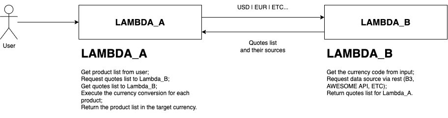

# Currency-Converter [Lambda project A]

This repository is part of my AWS Lambda function studies and there is no commercial purpose.

## Description:

User inputs a list of Products, the base currency of Product prices, the target currency they want to convert their product prices in and the purpose of the conversion - tourism or commercial. And the system executes the currency conversion over the Product list.

Lambda-A (this repo) executes the currency conversion math, it calls Lambda-B to get a list of quotes from different data sources. It does the maths over each Product price from the user input and finally returns the converted currency Product list.

## User input example:

```json
{
   "products":[
      {
         "description":"any_product_description",
         "price":10.50
      },
      {
         "description":"any_product_description_a",
         "price":66.60
      },
      {
         "description":"any_product_description_b",
         "price":18.30
      }
   ],
   "base":"BRL",
   "target":"USD",
   "purpose":"tourism"
}
```

## System output example:

```json
{
   "products":[
      {
         "description":"any_product_description",
         "price":10.50
      },
      {
         "description":"any_product_description_a",
         "price":66.60
      },
      {
         "description":"any_product_description_b",
         "price":18.30
      }
   ],
   "in":"USD",
   "purpose":"tourism",
   "source":"any_currency_data_provider"
}
```

## Features available:

## Software design and architecture:

Lambdas data flow diagram:

